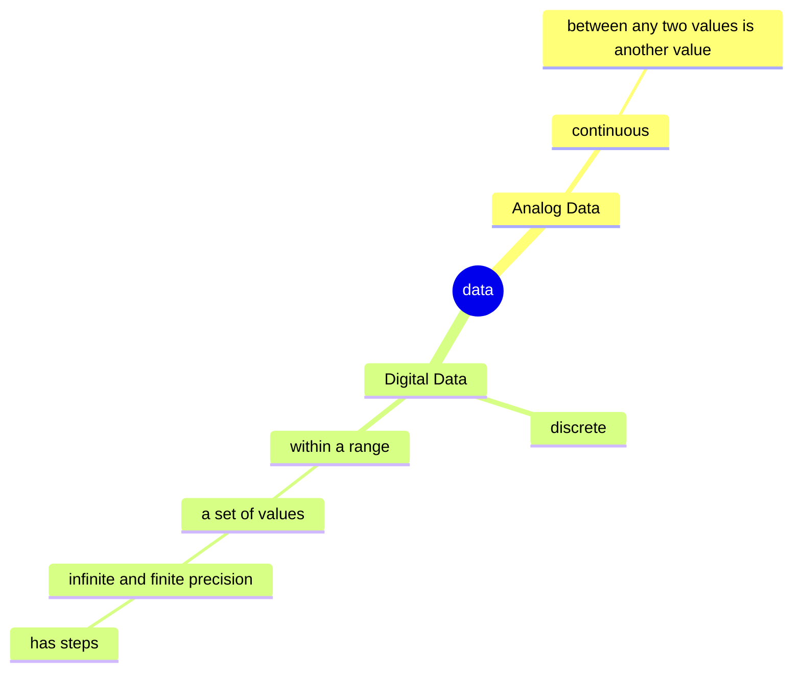
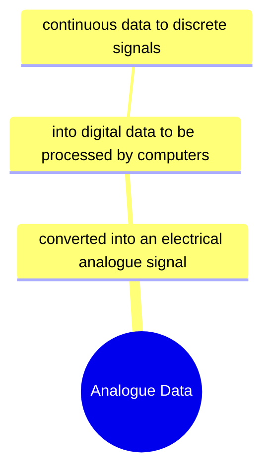
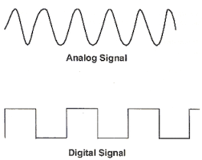

# 13/11/23

# Parity Bit Sender and Receiver

Sender and receiver both agree before hand if using odd or even parity bit.

sender = check the summuation of 1s in the byte and make it odd or even depending of which parity bit is used

receiver = check even or odd summation of 1s therefore ASSUMING there was an error or not

# Starter Acivity

11011010

Q1. because the original 7 bit had an even (summation) total number of 1s, we need to add a 1 at the most significant bit for it to make it odd as we are using odd parity bit.

Q2. more reliable and efficient, less likely to have an undetectable and unfixed bit fliping or errors, tells you where the error occured, can correct and detect multiple bits errors

---

# Learning Objectives

- Understand the difference between:
    - analogue
    - digital
        - 1. Data
        - 2. Signals

- Describle the principales of operation of an analogue to digital converter

# Analog Data

Analog Data = continuous, between any two values is another value

Digital Data = discrete, a set of values; infinite and finite precision, has steps

# Signals

Analogue Data = converted into an electrical analogue signal, then into digital data to be processed by computers, continuous data to discrete signals

