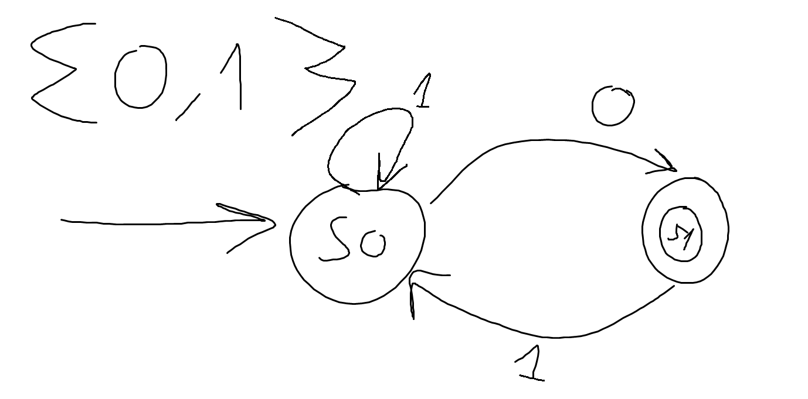

# 11/12/23

https://adacomputerscience.org/concepts/machines_fsm?examBoard=aqa&stage=a_level&topic=machines_with_memory

# terminology

- procedural abstraction:
    - computational method
    - 

- Functional abstraction;
    - we don't need to know everything what is being done on the back end
    - you don't need to understand how all works to use it

- reduced domain problems
    - reducing the problem (e.g, I want all the digits of PI = impossible, so we get an approximation)

- data abstraction
    - the reduction of a particular body of data to a simplified representation of the whole.

- atomic data type:
    - integers

- automation
    - creating algorithms
    - implementing the algorithms in program code
    - implementing the models in data structures
    - executing the code

# Finite state machines

### model used to verify if a regular language is valid or not

- abstract model of computation to used to model logic
- concrete:
    - implementation, taking from an abstract idea to make it real 
- abstract:
    - theoretical model

- formation of a language:
    - regular languages
        - binary is a language (has alphabet {0,1})
            - different values have different meaning
        - be denoted/defined by characters
        - orders need to be in the right
        - whether if not a string is correct or not
        - words = token (i.e "if" statement in python is a token)
    - e.g English
        - the dictionary
        

### finite state machines can only be in one state at a time

## diagrams

- terminology
    - state
    - start state
    - accepting state
        - has to end on the accepted state to be valid
    - transition with a labelled input

---

Vending machine exemple:

- 1st step:
    - the alphabet : {5p,10p,20p}
    - if inputs are reaching the accepting state
        - then the inputs are valid
- from 1 state to another, you can't have duplicates

---

Exemple:

- description
    - it either stars with a 0 or 1 or more 1s