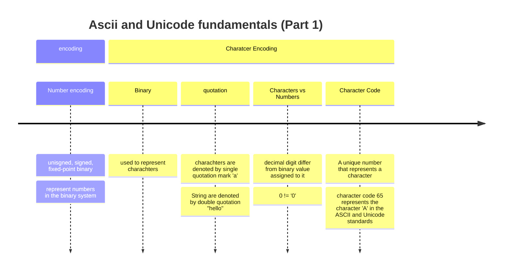
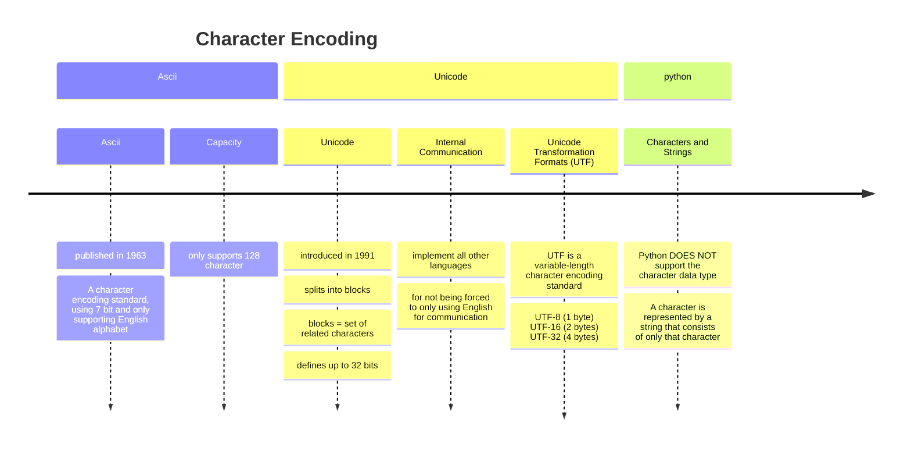
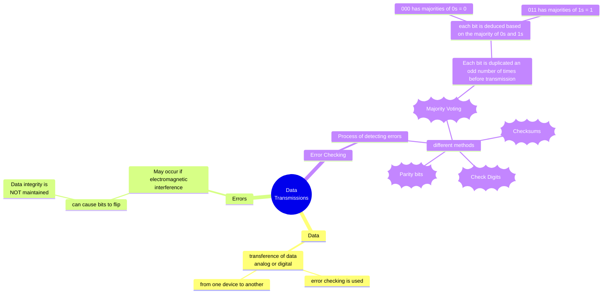
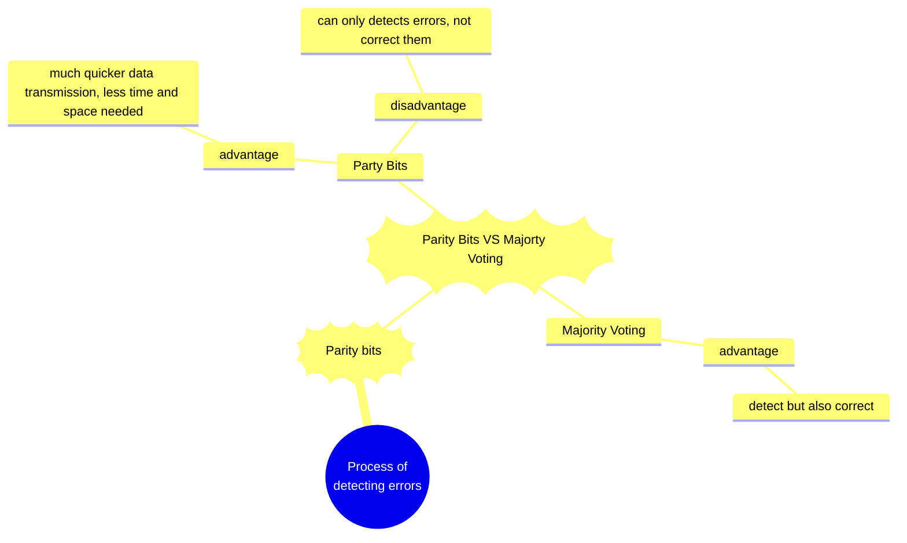

---

# Starter activity

1. UNICODE has all ASCII character code represented, Unicode can represents all languages character whereas ASCII can only represent the English alphabet

2. Ordinal is the order within a sequence (i.g an index)

---

# 09/11/23

Q2. Explain how to convert decimal digit characters into their corresponding decimal value as binary:
- decimal character and decimal value = you need to -48

# Transmissions

## Data

Data transmission = transference of data, analog or digital

from one device to another

error checking is used to ensure data transmission

## Errors

- May occur if electromagnetic interference:
    - can cause bits to flip:
        - Data integrity is NOT maintained

## Error Checking

- Process of detecting errors:
    - different methods:
        - Parity bits
        - Majority Voting
        - Checksums
        - Check Digits

### Parity Bits

- Parity bit = an additional least or most significant bit that is used to detect errors
    - How:
        - By Checking wether the summation of 1s, including the parity bit, is odd or even
        - way of checking wether or not there is an even or odd number in the binary

# Majority Voting

- Each bit is duplicated an odd number of times before transmission
    - each bit is deduced based on the majority of 0s and 1s

|000|001|010|011|100|101|110|111|
|-|-|-|-|-|-|-|-|
|0|0|0|1|0|1|1|1|

Here, the 000 has majorities of 0s = 0 for the bit

011 has majorities of 1s = 1 for the bit

# Parity Bits VS Majorty Voting

- Party Bits:
    - advantage:
        - can only detects errors
    - disadvantage:
        - much quicker data transmission, less time and space needed

- Majority Voting:
    - advantage:
        - detect but also correct (most) errors that occur during data transmission
    - disadvantage:
        - data is being tripled to check, so much slower and takes much longer

### Checksums

1. Another way to detect erros
2. checksums is the result of applying an algorithm to a block of data
3. sent alongside to be checked after transmission

Adding an extra BYTE

### Check Digits

A check digit is a form of redundancy check used for error detection on identification numbers

- identify a product (e.g. an international standard book number (ISBN) or a barcode) or verify a user
    - main purpose of check digits is to recognise and prevent human errors when entering or assigning identification numbers

### Main points:

- Check digits are ***extra digits placed at the beginning or end of a number to identify a product or verify a user.***

- The purpose of check digits is to ***prevent human errors when entering or assigning identification numbers.***

- Check digits are ***calculated using algorithms that involve modulo arithmetic.***

Exemples:

- The ISBN-10 code of a book includes a check digit that is calculated to ensure that the code is valid.
    - The system will perform a calculation to verify that the ISBN was entered correctly and notify the user accordingly.