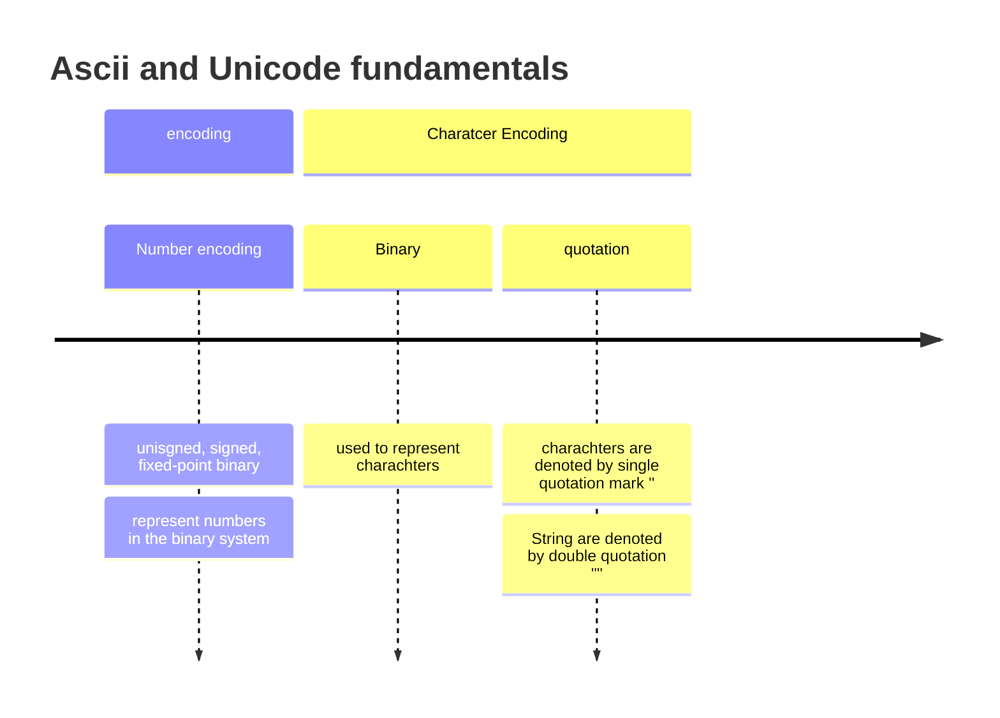

# 07/11/23

# Ascii and Unicode fundamentals Part 1

## Number encoding

unisgned, signed, fixed-point binary = represent numbers in the binary system

## Character Encoding

Binary = used to represent charachters

charachters are denoted by single quotation mark ''

String are denoted by double quotation ""

## Characters vs Numbers

decimal digit differ from binary value assigned to it

0 != '0'

## Character Code

A unique number that represents a character,
character code 65 represents the character 'A' in the ASCII and Unicode standards

## Ascii

a character encoding standard published in 1963, using 7 bit and only supporting English alphabet

## Internal Communication

Unicode was introduced in 1991 = international communication = implement all other languages = for not being forced to only using English for communication

# Unicode

Unicode = splits into blocks

blocks = set of related characters

unicode defines up to 32 bits

## Unicode Transformation Formats (UTF)

UTF is a variable-length character encoding standard = including UTF-8 (1 byte), UTF-16 (2 bytes), UTF-32 (4 bytes)

## Characters and Strings

Python DOES NOT support the character data type

A character is represented by a string that consists of only that character

---

# Starter activity

1. UNICODE has all ASCII character code represented, Unicode can represents all languages character whereas ASCII can only represent the English alphabet

2. Ordinal is the order within a sequence (i.g an index)

---

# 09/11/23

Q2. Explain how to convert decimal digit characters into their corresponding decimal value as binary:
- decimal character and decimal value = you need to -48

# Transmissions

## Data

Data transmission = transference of data, analog or digital

from one device to another

error checking is used to ensure data transmission

## Errors

- May occur if electromagnetic interference:
    - can cause bits to flip:
        - Data integrity is NOT maintained

## Error Checking

- Process of detecting errors:
    - different methods:
        - Parity bits
        - Majority Voting
        - Checksums
        - Check Digits

### Parity Bits

- Parity bit = an additional least or most significant bit that is used to detect errors
    - How:
        - By Checking wether the summation of 1s, including the parity bit, is odd or even
        - way of checking wether or not there is an even or odd number in the binary

# Majority Voting

- Each bit is duplicated an odd number of times before transmission
    - each bit is deduced based on the majority of 0s and 1s

|000|001|010|011|100|101|110|111|
|-|-|-|-|-|-|-|-|
|0|0|0|1|0|1|1|1|

Here, the 000 has majorities of 0s = 0 for the bit
011 has majorities of 1s = 1 for the bit

# Parity Bits VS Majorty Voting

- Party Bits:
    - can only detects errors

- Majority Voting:
    - detect but also correct (most) errors that occur during data transmission