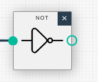
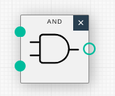
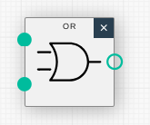
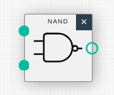
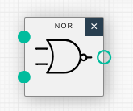
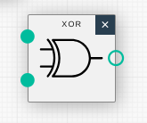

[Adacomputer Logic Gate](https://adacomputerscience.org/concepts/boolean_logic_gates?examBoard=all&stage=all)

[Logic Gate Simulator](https://academo.org/demos/logic-gate-simulator/)

# Logic Gate

- What is a logic gate
    - UNARY
        - 1 input
    - BINARY
        - 2 inputs
    - high and low voltage

- A buffer
    - produce the same output as his input
    - if input is 1, output is 1

- If circle at the end of a logic gate
    - then = a NOT gate

---

- NOT gate
    - produce the opposite output

- AND gate
    - if both inputs are 1, produces input of 1

- OR gate
    - if either of their inputs are 1, produces an input of 1

---

- NAND gate
    - like AND gate
        - the NOT variant

- NOR gate
    - like OR gate
        - the NOT variant

- XOR gate
    - exclusive
        - one or the other but not both
        - can be created with an OR, NOR, AND gate

---

# Construct a truth table

[Ada compter science | Truth table](https://adacomputerscience.org/concepts/boolean_construct_truth_table?examBoard=all&stage=all)

- Dott = AND
    - Exemple:
        - A . B (A and B)

- inversion
    - a straight line on the letter

- (plus) + = OR
    - A + B (A or B)