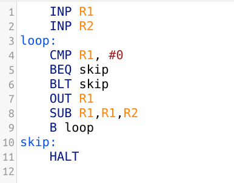

# internal hardware components

## Processor
- main memory
    - stores data as well as intructions
    - number of memory addresses is constrained by the width of the address bus
        - each address can store a fixed numner of bits
            - determined by the processor

- Inside the CPU
    - all coordinated with the buses
        - data bus
        - address bus
        - control bus

# Others

- I/O controllers
    - external devices
        - USB
    - cannot be directly connected to the processor
    - I/O controller
        - acts as an interface

- Fetch-execute cycle
    - fetch the next instruction
    - decode the instruction and prepare to execute the intruction
    - execute instruction

- Stored program concept

# System buses

- system buses
    - Sending information via buses
    - get coordinated by buses
        - data bus
            - bidirectional
            - has bits of information
        - address bus
            - one way
            - carries the adress of a memory location
            - memory allocation
            - tells where the data should go
        - control bus
            - bidirectional
            - controls data
                - memory:
                    - read
                    - write
                - bus:
                    - request
                    - grant
                - clock
                    - synchronise
                    - faster the clock, the more informations it processes

---

# Words

- memory is divided up in equal units called words
- word length is usually 8,16,32,64 bits
- each word has a separate memory address
- width of your buses
- if bus = 8 bits, then word = 8 bit
- word = width of buses
- bidirectional

# Architecture

### John | Von Neumann

- together

- most common
- instructions and data are stored in a common main memory
- memeory for program and memory for data
    - separated
- much cheaper, only 1 hard drive needed

### Harvard

- seperate

- seperates the data and instructions into separate memories using different buses
- program instructions and data are no longer competing for the same bus
- when we need speed / specialist computers

- more for medical equipement

---

# interrupts

- keyboards
    - tells the cpu you have to handle this now

---

