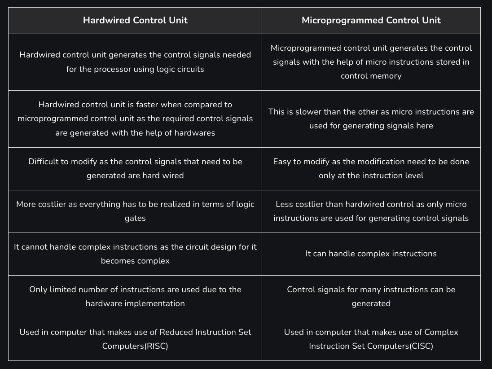
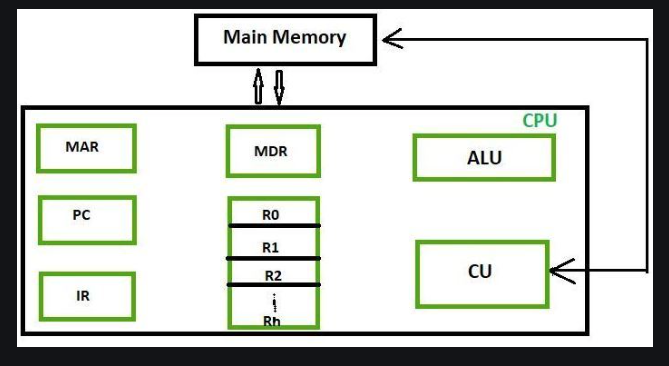

# Structure and role of the processor and its components

### Questions

1) machine code
2) process = assembling, called an assembler
4) Assembly : interact directly with the main memory

- Meaning of "the stored program"

- machine code instructions stored in main memory are fetched

---

## Processor 

- processor
    - brain, execute instrutions and manipulate data according to the program being run
- control Unit
    - brain of the CPU
    - using signals

- quantum processor
    - uses light

### LO: the processor main components

- ALU
    - arthmetic and logic unit
    - performing arithmetic calculations and logical operations that include
    - equipped with an assortment of electrical output and input connections

- Opcode
    - operation code
    - assembly

---

# control unit

- It is the boss
    - it tells who and what do
- decodes every instructions to determine what needs to be done

---

# Microprogrammed control VS Hardwired control

---

# registers

- locations of very high speed computer memory within the processor
- number and size of registers in a CPU are determined by the processor design
    - have significant impact on its performance and capabilities

---

# clock

- crystal
    - gives pulses

# CPU cores VS clock speed

