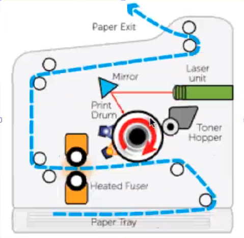

# 19/04/2024

## 4 input, outputs in details

- barcode reader
    - used to identify
        - can be tracked
        - track badage
        - holds links to website
        - wifi SSID connector

- pen style code reader
    - convert

- laser scanners
    - laser beam across a 
    - laser sweeps the barcode
    - read on different postion

- charge-coupled device (CCD)
    - photo diode

- camera-based readers

### write a paragraph that outlies the different types of readers

- digital camera
    - light come in
    - filters
    - CMOSS sensor

- mirros
    - split into colors filters
        - blocks all light apart the color of the filter

- charge-couple device
    - CCD
    - uses 100x more power than CMOS

- CMOS
    - cheaper
    - 

- sensors made up of tiny sensors

- shades of grey
    - measuring the intensity of light

- filter
    - capture more green
        - to look more natural
        - eye used to seeing green
    
---

- ink stored in the Toner Hopper
    - dried powder ink
- create a bitmap image

- negatively charge the Print Drum
- laser will ingrave the bitmap
- drum rotates and picks up toner hopper like a magnet
    - drum is covered in ink
- drum will paint on the paper tray
- Paper tray is bonded by the toner with heat and pressure

- heated fuser
    - to bond the paper tray and the toner together by applying pressure and heat

- vectors
    - shapes
    - colors shades

- bitmap
    - images made out of pixel