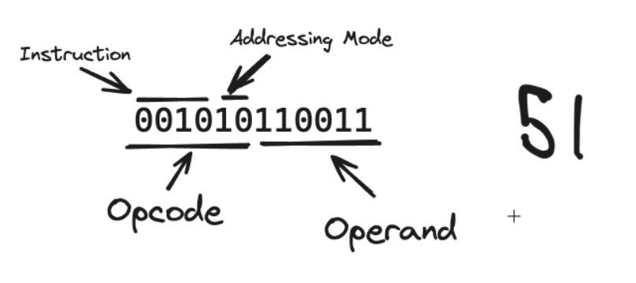
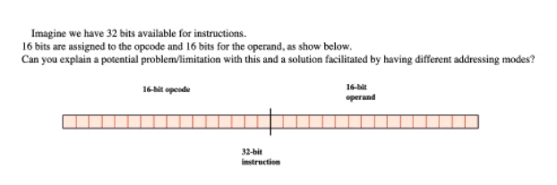
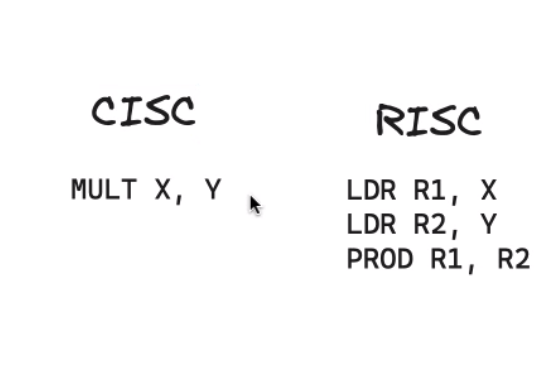

- contact time
    - regular lesson
    - thursday 4-5 pm office

- homework
    - at the end of every lesson
    - ada computerscience

- instructions
    - 32 bits
    - 64 bits

---

- instructions sets

    - CISC
        - multiple clock signal per instructions
        - PC
        - lapots
        - complex instructions computing
    - RISC
        - one clock signal per instructions
        - washing machine
            - such a specific purpose
        - reduced intrustions

- pipelining
    - speed of the processor
    - register
        - then process the instructions

    - allow us to speed up program
    - run independent instructions at the same time