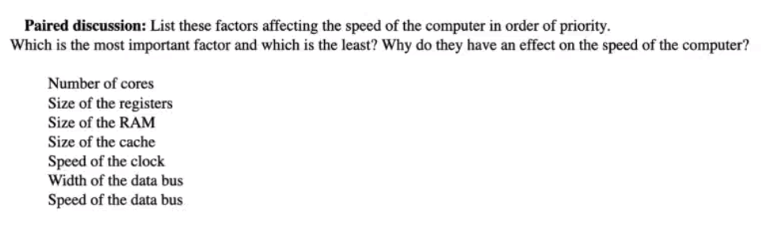

# 25/04/24

- CU
    - control unit: it directs the operation of the processor
    - ochestrating the porcess 

- ALU : arithmetic logic unit
    - performs logical operations
    - commanded by the CU
        - is 5 greater than 2 ?
            - ALU checks
    
- Decode Unit
    - decodes the instruction fetched by the MDR
    - translate the binary into what it means

- MDR
    - Memory Data Register
    - holds the information fetched from the main memory

- PC
    - Program Counter
    - register that manages the memory address of the intruction to be executed next

- MAR
    - Memory Address Register
        - either stores
            - memory address from which data will be fetched
            - address to which data will be sent
    - stores the address that colerate with 
    - stores the data

- CIR
    - Current Instruction Register
        - stores temporarirly current the instructions being executed
    
- ACC
    - Accumulator
        - store the result of the calculation
        - provides the data to the ALU

- general-purpose registers
    - calculate data and store addresses
    - cache
        - super fast

- Clock
    - number of cycles executed by the CPU per seconds
    - measured in hertz

---

# Buses

- address bus
    - mono-directional
    - carry an address one way
        - from CPU to RAM

- Data Bus
    - bi-directional
    - can carry instructions
    - transfers Data between
        - memory to CPU

- Control Bus
    - carries the control signal
    - bi-directional
    - manages communication between
        - CPU to other components
    

---

# Factors Impacting to the Performance of the CPU

- Performance : 
    - carry out instructions faster

- More performance:
    - consume more power
    - produce more heat
        - need cooldown 

## Cache

- extremly fast
    - low storage capacity
- fecthing memory
- stores in the cache

- next time MDR is looking for something
    - will search in the cache
        - because much faster

- reduces the reliance of the memory

## Cores

- Increasing number of cores
    - ability to handle more tasks simultaneously
    - improves multitasking
        - tasks can be spread-between cores which allow more instructions to be executed at the same time
- overclock
    - will overclock all cores and not only one

    A multi-cores CPU gives the ability to do silmutaneous tasks which can be spread-between cores which allow more instructions to be executed at the same time, improves multitasking

- much more complicated circut
- more power comsuption

- not all programs can take advantages of the CPU being multi-cores
    - some will only take one core

## Buses

### Address bus

- 8 wires
    - hold or not the charge

# Paired discussion

- Most impactfull factor
    - number of Cores
    - Speed of the clock
    - size of registers
    - size of the cache
    - width of the data bus
    - size of the RAM
    - speed of the data bus

- what effect does the data bus
    - Increases CPU performance ,simply because it increases the amount of data which can be sent per cycle

- What effect does the clock speed
    - Increases CPU performance ,simply because it lowers the time needed per cycle. however it consumes more power and therefore produce more heat, so more efficient cooling methods will be needed