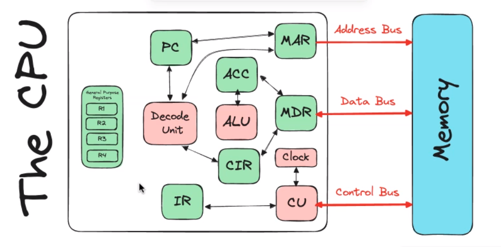

# Radio frequency identification (RFID)

- used to identify
- no battery
    - has antena
- black dott at the middle = the chip

- Tags
    - active : needs a battery to be able to read data
        - size of airpod case
    - passive : no battery/current supplied by radio signal
        - much smaller in size