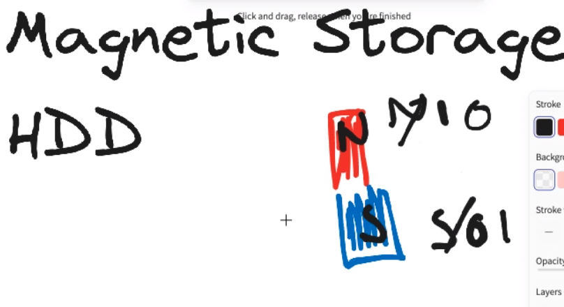
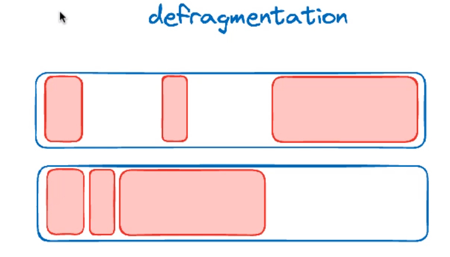
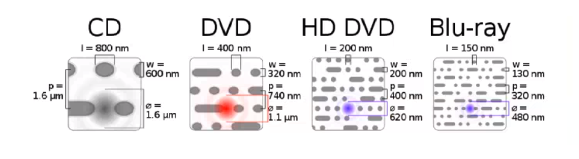
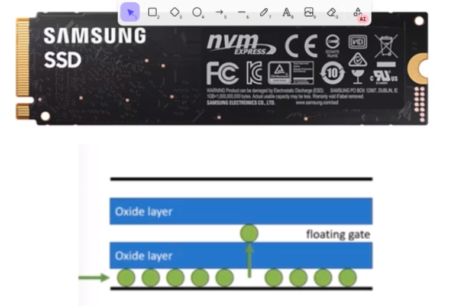

# 23/04/24

## Magnetic Storage

- south
- north

- floppy disk
    - uses magnetics

## defragmentation

### Utility software:

- write sequenctially

- looking for gaps
    - lost a lot of time

- bottom one is defragmented

- benefits from defragmentation, make it quicker

- very sensitive to magnets

---

## Define magnetic storage in 16 words or less. Make 3 points

- has north/south pole
- write sequencially
- rotates to read/write data

---

# Optical

- CD
    - compact disk
        - audio    
- DVD
    - films

- Blu-Ray
    - high definition films
    - blue light
        - smaller width
- pits or land
    - pits = little holes/gravures
    - land = no gravure
    - laser

- width
    - gets thiner
        - more space for the pits

- disks
    - read-only
        - come already defragmented

### Cons VS pros

    sequentially = slow reading speed

- highly portable
- laser to read data 

---

# SSD (solid state drive)

- no mechanical bottleneck

- non-mechanical
- limited number of read/writes
- more expensive

- hdd
    - much cheaper
    - data center
    - infinite re-write
    - fail after a decade

---

- storage:
    - hdd
        - customers information: e.g fidelity cards
        - records of payments

- input 
    - card reader
        - allow for faster payments

- output
    - screen
        - displays the amout of money and important information to the customer

---

Opcode, Operand, Instruction,address mode