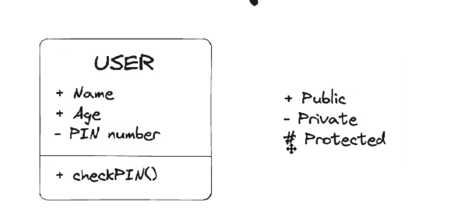
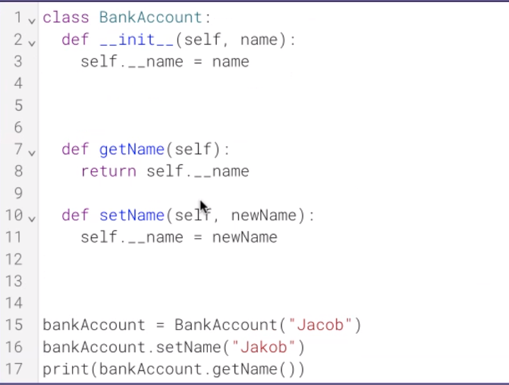
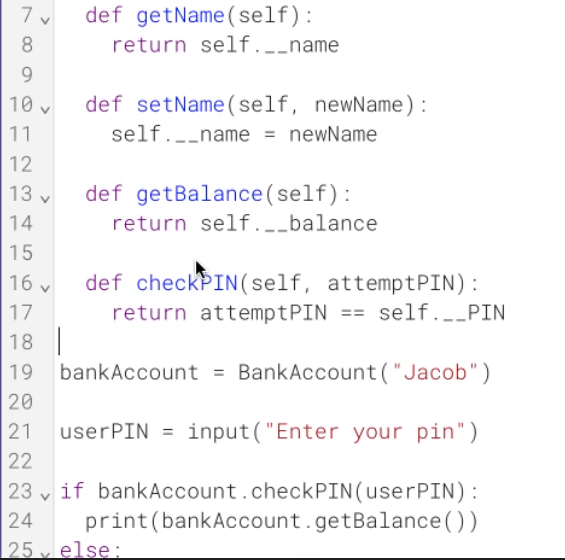
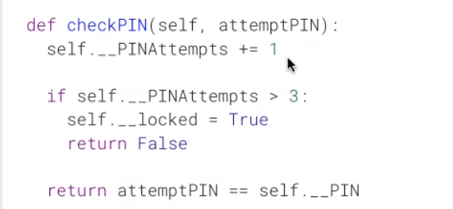
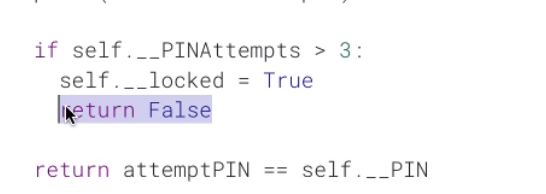

# Access modifiers

### hide a part of the program



- Public
    - can be seen by everyone

- Private
    - only access within the class

### inheritance

- Protected

---

# exemple

- Bank Account
---------------
-Name
-Registered Date
-Region
-Balance
-Interest Rate
-Withdraw/Deposit amount
---------------
+getName()
+getBalance()
+getRegion()
+getInterestRate()
+getOption(Option)
+setAmount(Withdraw/Deposit Amount)

---

# Code

- name = private
    - only see it inside of a class
        - need to do a function and return the value to be seen

```py
self.__name = name
```

- not access it, we don't know it exists










- exiting the program early with the
    - return False
    - so "return attempt" never runs