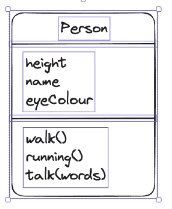
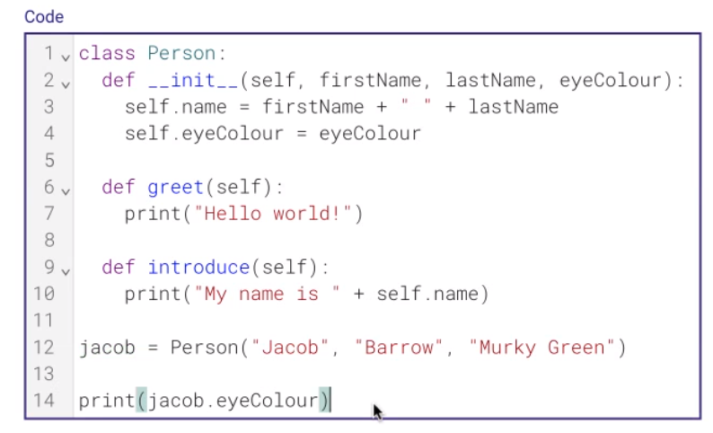

- template for an object

- Person's template
    - object

- class itself doesn't do anything
- the object does things

- class never run until object created

### bunch of subroutines that all belong to the same group

- self refers to the object being called

---

# Another example

