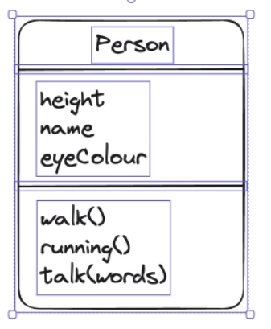
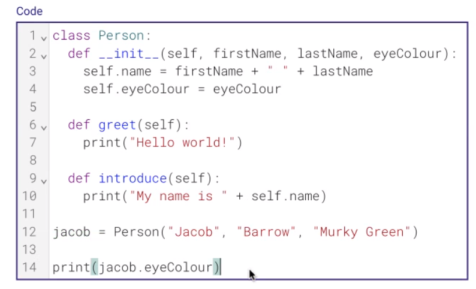
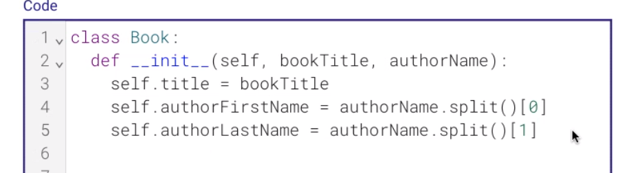
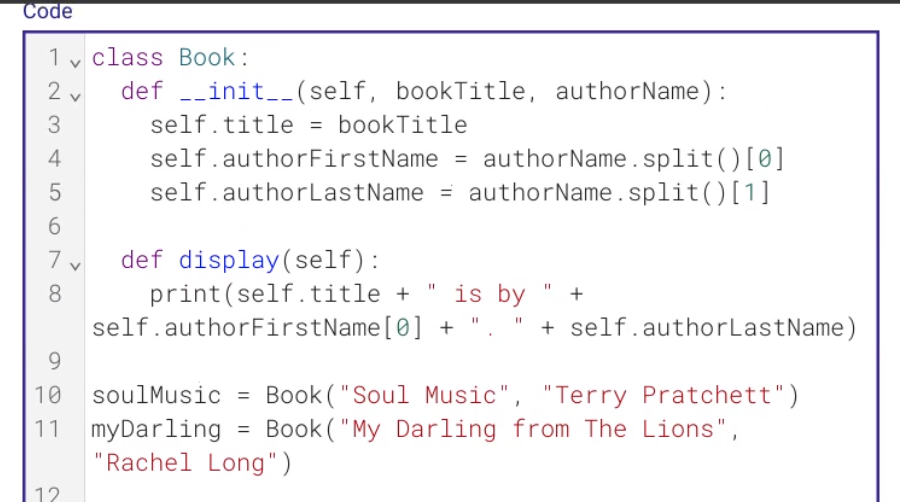
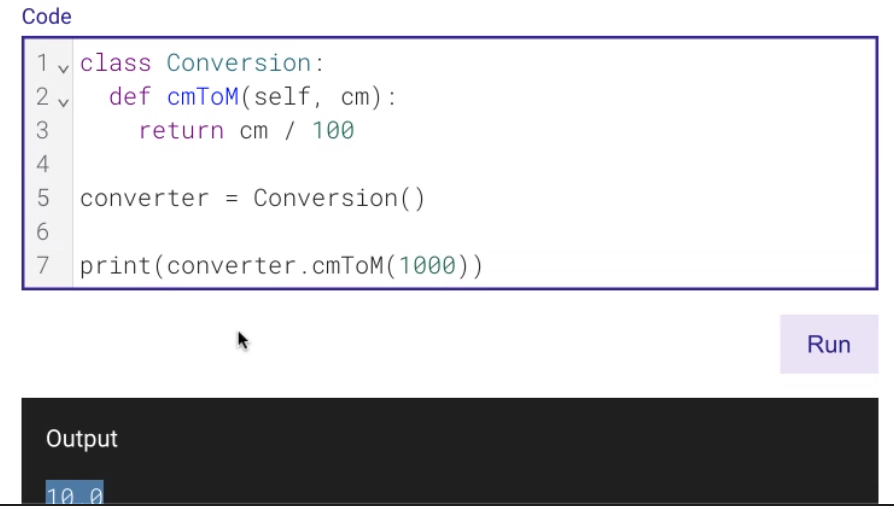
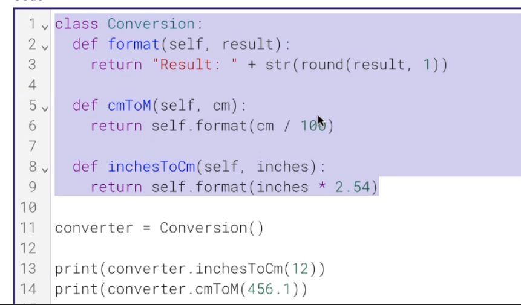

- template for an object

- Person's template
    - object

- class itself doesn't do anything
- the object does things

- class never run until object created

### bunch of subroutines that all belong to the same group

- self refers to the object being called

---

# 17/05/24

- class diagram for a book

- attribute
    - cover
    - book name
    - pages
- actions
    - read(startPage)
    - printPictures(pictures)

---

- self
    - current object

- .split()
    - create array
        - "helo yes".split()
            - ['helo','yes']

- time code : 28min-32min

---

- Without init

