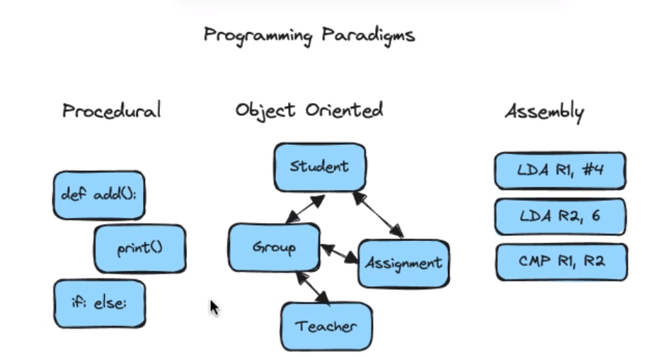
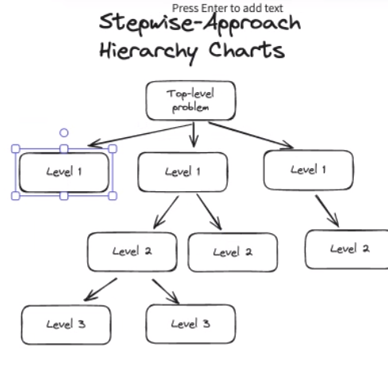
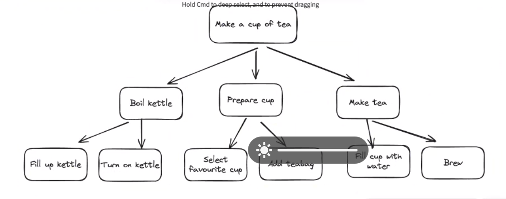
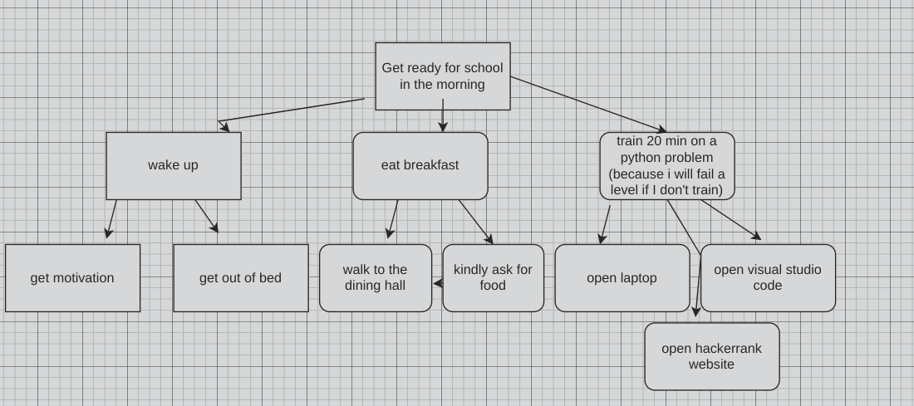
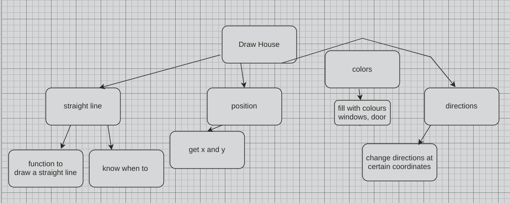

# Programming Paradigms

- procedural
    - all about subroutines

- Object Oriented
    - real obkect

---

# Structured Approach

- Decomposition
    - break down difficult problem into easier ones

- Stepwise-Approach
    - Hierarchy Charts

---

# house step-wise

