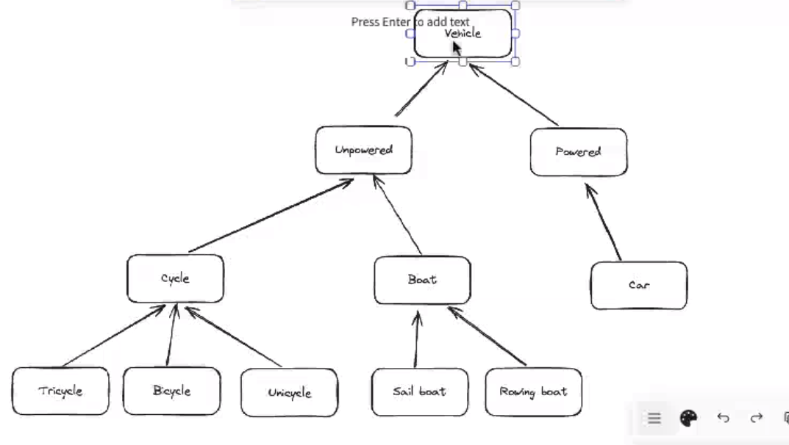
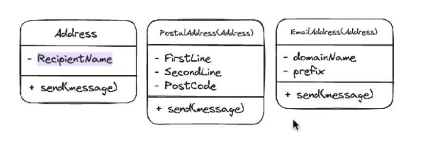
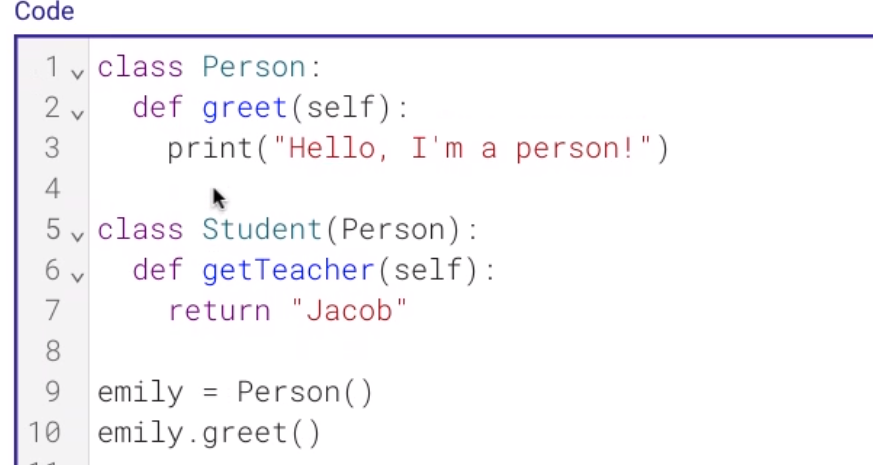
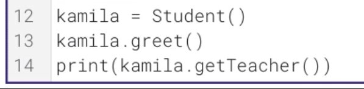
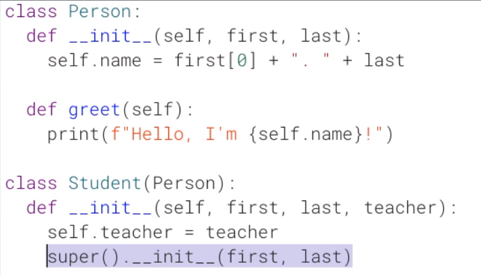
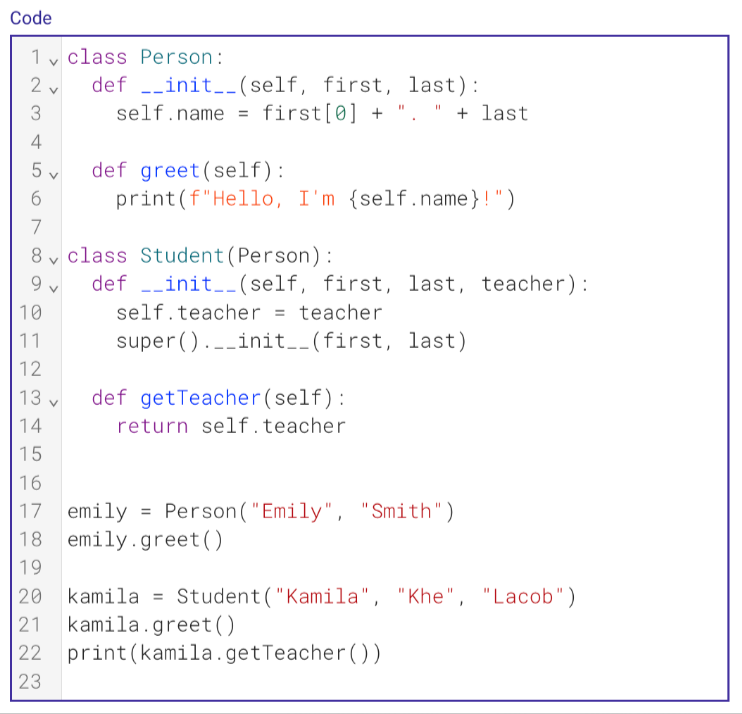
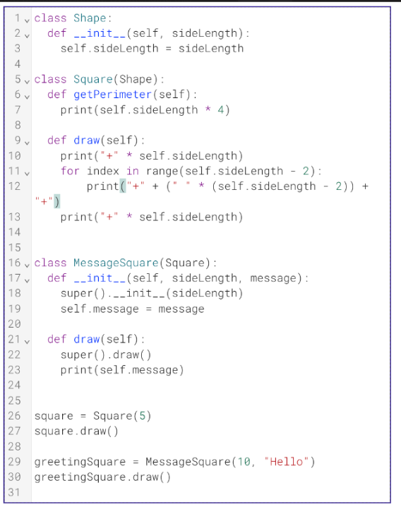

# inheritance

- Address
    - parent class

# Code

---

- class can contain class
    - taking their _ _ init _ _ info

## Supa function

- self
    - refers to ourselves

- super
    - refers to parents

- avoiding repeating ourselves

---

- More complicated example

