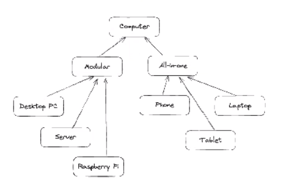
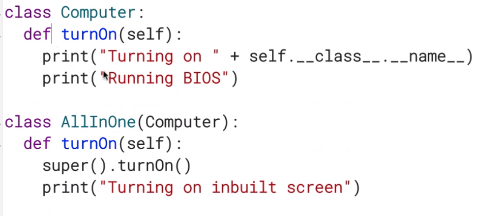
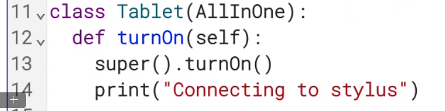

# Polymorphism

- action is shared up and down a class hierarchy

- each class implement this action in a appropriate to itself

- all have a TurnOn() function

- turnOn()
    - supply power to the motherboard
        - load the BIOS

