# 09/05/24

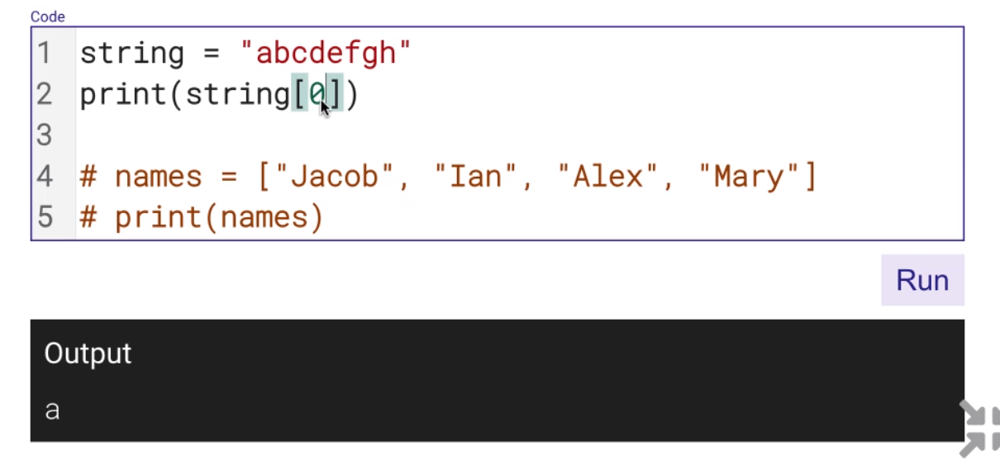

---

# String slicing

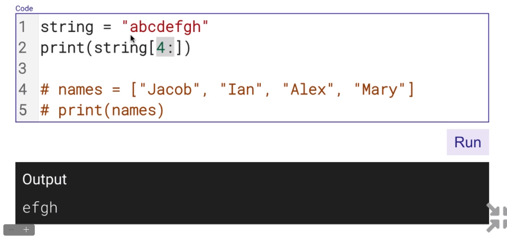

- start at index 4, and then everything else after that

- up to the third character

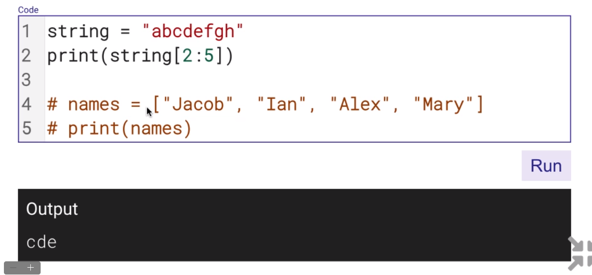

- Middle

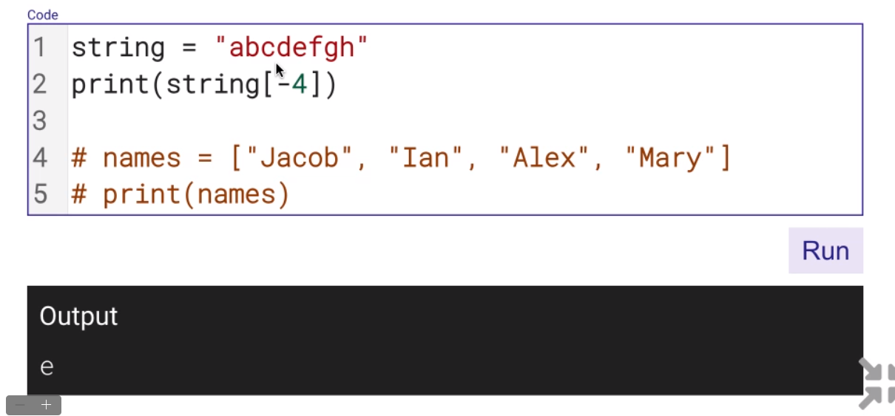

- count backwards

---

# Append

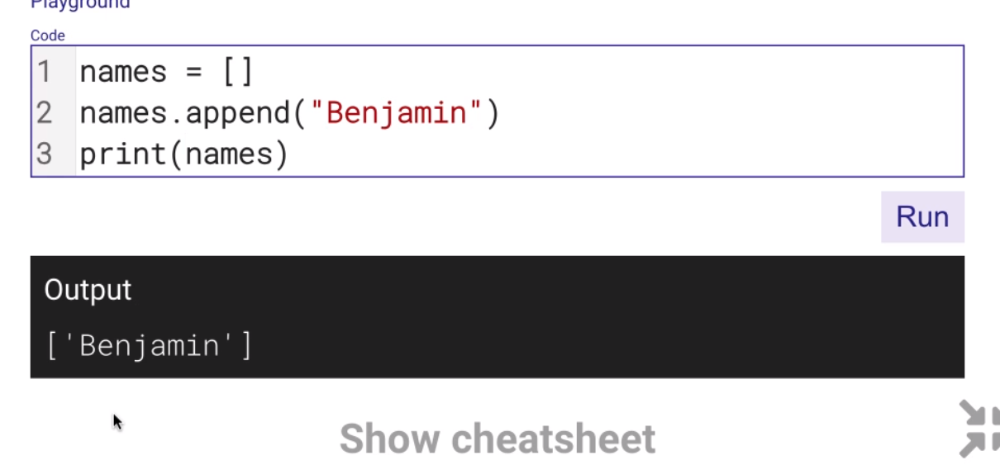

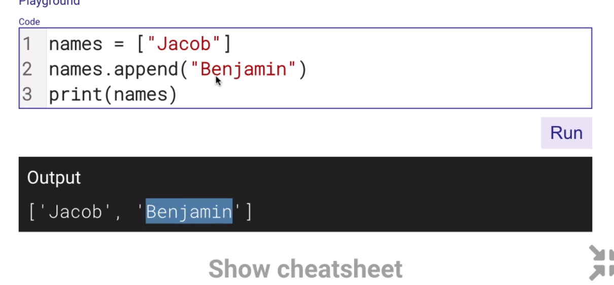

- appends at the end

## For loop

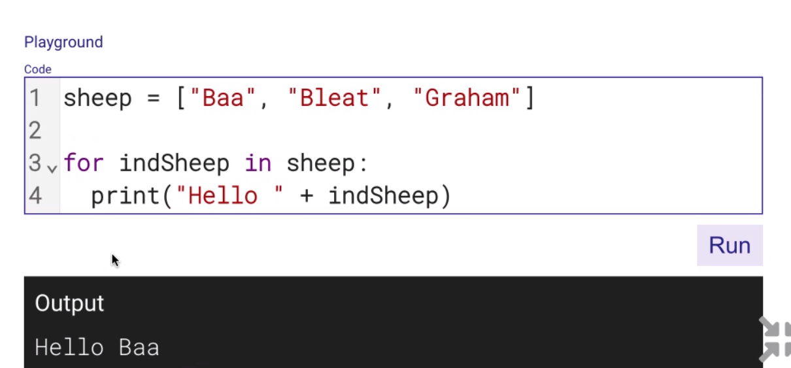

---

# 2D arrays

- why we use 2D

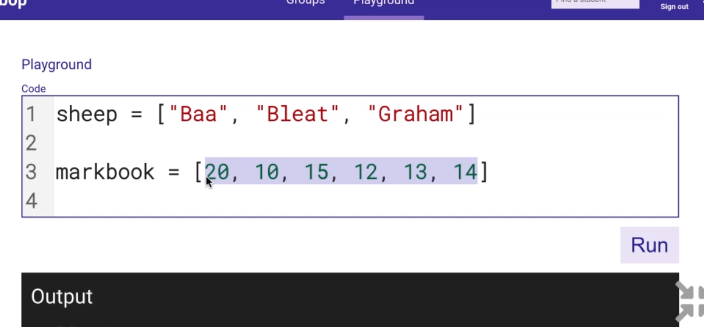

    a list of a list

### 1D array = a list

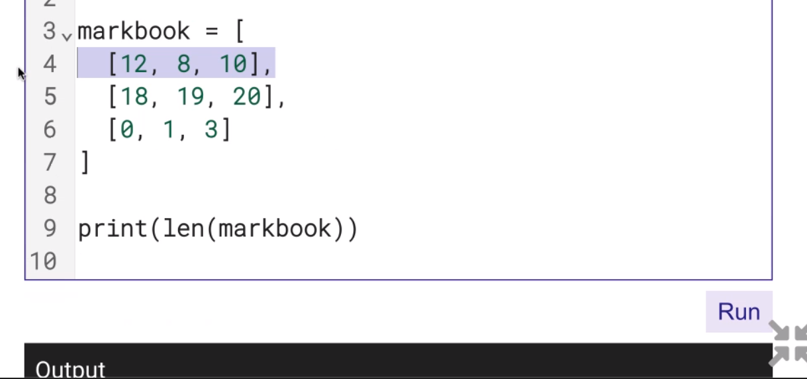

- it will output 3
    - it counts the number of list within the array

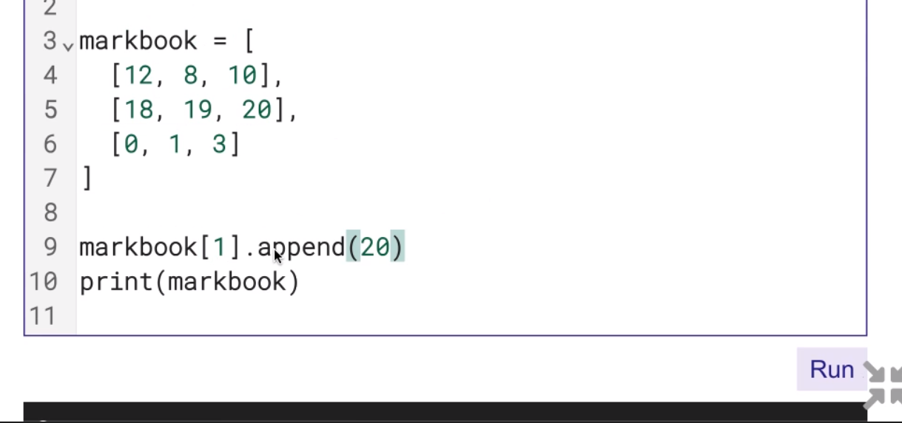

- append a single element within a list

---

- iterrates

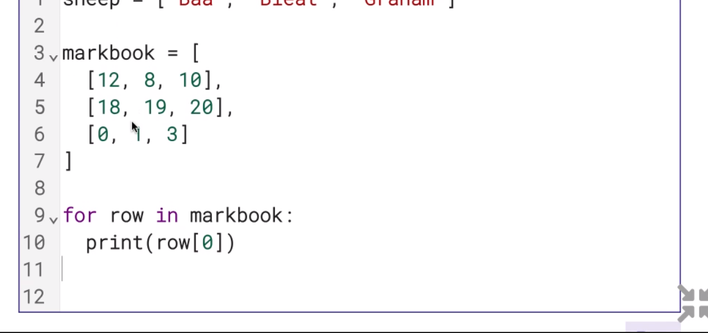

- print the first element of each array

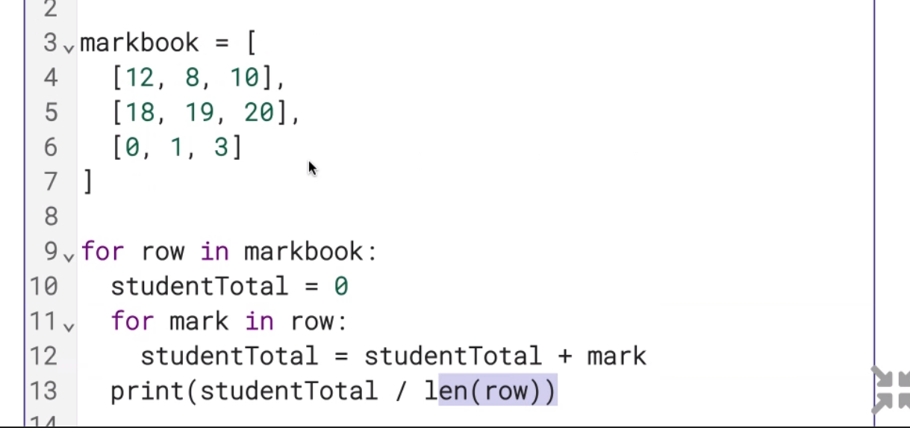

- calculates the average of the sutdents grade