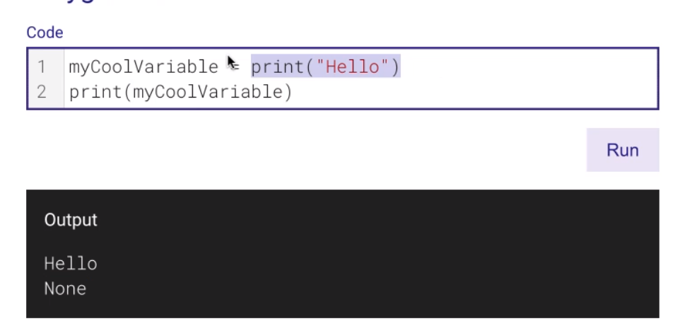
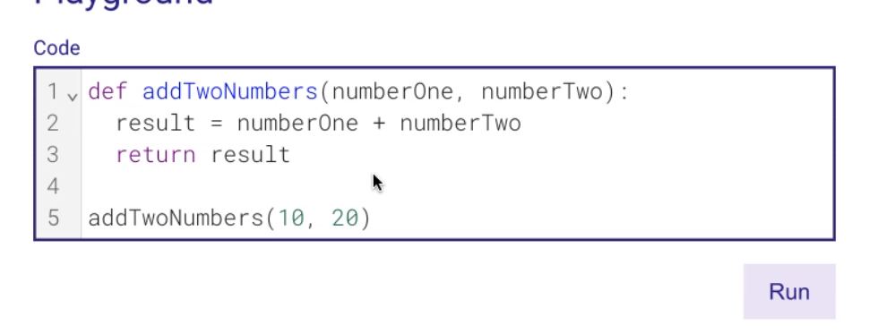
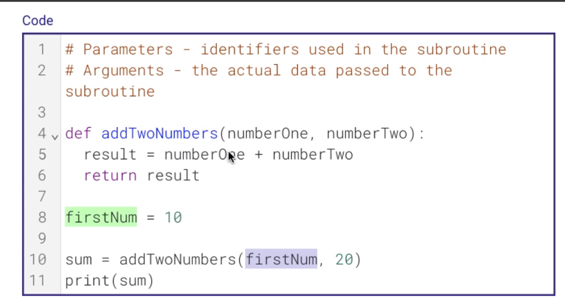

# Subroutines

- procedures
    - does NOT return a value
- functions
    - does return a value

---

- print
    - does NOT return anything
    - procedures

- len
    - DOES return a value

- str
    - function

---

- parameters
    - when calls, assign value to the parameters

# Parameters VS arguments

- parameters
    - identifiers used in the subroutine
- arguments
    - the actual data passed to the subroutine

---

# scop

- local
    - definied within the scop (within the function)
- global
