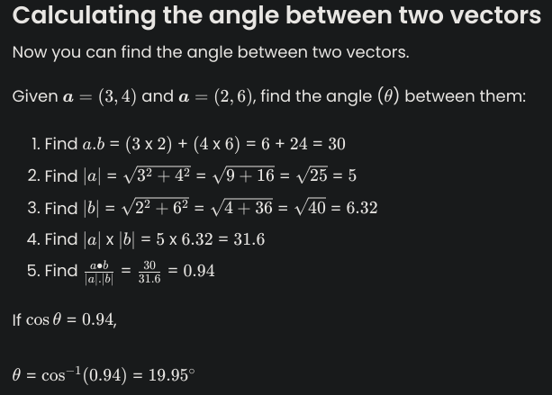

# Vector

- both magnitude and lenght

- Magnitude
  - size of the vector
- direction
- NOT position
- represented by an arrow

# Notation

### notation (4-vector)

- 4 dimensiosn spacetime
- (x,y,z) and t representing Time as the 4th dimension

### Function

    S = R means 'S maps to R'

## A vector can be represented:
- As a list
- As a 1-D array
- As a dictionary
- Graphically
- Using set notation

## operations that can be applied:
- Vector addition and subtraction
- Scalar–vector multiplication
- Convex combination of two vectors
- Dot or scalar product of two vector

## Abstraction

- model that represents only the part of reality that we are interested in
- ignores irrelevant detail
- abstract data type = ADT
  - list in pyhton

---

- Vectors are sometimes named by their endpoints

## Representation

- List
```
list v ← [2, 4]
```

- 1-D array
```
array v [3]
v ← [7, 4, 12]
```

- Dictionary
```
0 ↦ 2.4
1 ↦ 6.8
2 ↦ 4.5
3 ↦ 9.2
```

---

## Vector opperation

- Addition:

    a = (5,13), b = (29,5) 
    a + b = (5+29,13+5) = (34,18) .

- multiplication
  
    a  =  (5,8)  by  2  will give the vector  (10,16) 
    b  =  (35,15)  by  0.5  will give the vector  (17.5,7.5)

# m change

- direction of vector not change
  - if  m  >  1 , it will increase in size
  - if  m  <  1 , it will decrease in size.

- Scalar-vector multiplication will result in scaling.
  
### Exercice

Given the vectors:  v  =  (18,20)  and the scalar  s  =  0.75 , what is  v  x  s ?

```
Answer:  (13.5,15) 

18  x  0.75  =  13.5 

20  x  0.75  =  15
```

---

## Convex combination of two vectors

- used in computer games

- The expression is:
        (α *  u ) + (β *  v )
- also:
        α u  + β v

- Where:
  - u  and  v  are each vectors
  - α + β = 1
  - and α and β are each greater than or equal to 0
  
## Dot product of two vectors

- operation on two vectors that returns a scalar value.
- sometimes also called scalar product.

- Exemple:
        a  =  (2,  - 1)  and  b  =  ( - 7,  - 4) 
        then  a  ∙  b  = ( 2  x - 7 ) + (- 1  x - 4 ) = -14+4  = -10

- more:
    
  - Given the vectors:
```
    a  =  (1,3,5) 

    b  =  (12,−4,7) 

    What is  a  ∙  b ?

    Answer: 35

    (1 x 12) + (3 x -4) + (5 x 7) = 12 + -12 + 35 = 35
```
## application of dot product:

- Dot product of two vectors:
  - essential when you want to calculate the angle between the two vectors.

        formula to calculate the angle ( θ ) between two vectors as:

        cosθ  = a.b/∣a∣.∣b∣

- For your exam, you just need to know that finding the angle between two vectors is a possible application of dot product
  
## Calculating the magnitude

- Pythagoras
  

​  
## Using vectors to represent graphic

- Vector graphics represent images using geometric shapes that are defined in terms of points on a Cartesian plane.

- used where images need to be rescaled frequently without losing image quality and with no considerable change to the file size.
​
### why use vector

- graphics and 3D graphics
- computer games/simulations
  - a ship steering against the wind and sea, calculating collisions
- Multiple dimensions
  - 2,3 or more

# Python

- List is the preferred representation
- R² vector
  - vector = [7,89]

## Vector viewed as a function
- dictonaries

# Exercices

2. x,y,z,t
3. R = [8,7,6], R³
4. 0 = 1.5
1 = 3.4
2 = 6.1

