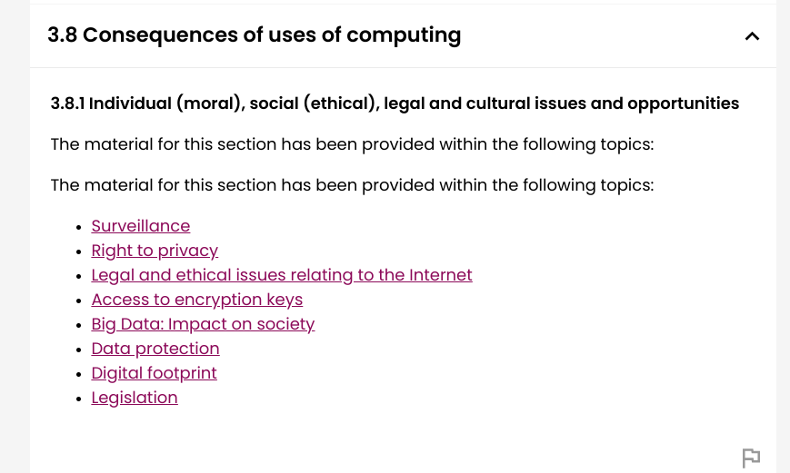

https://www.aqa.org.uk/subjects/computer-science-and-it/as-and-a-level/computer-science-7516-7517/subject-content-as/consequences-of-uses-of-computing

# GDPR and COPYRIGHT

# Case study

- not under the same regulations
- traded in any moment
- not stable / 

- environement issues
    - power consomation
        - green energy ?

- heat production
    - machines producing a lot of heat
- government centralization of currency

---

# Ethics

- 4 categories:
    - Individual (moral)
    - social (ethical)
    - legal and cultural issues and opportunities

---

# Exemple

- Moral VS legal
    - moral = individual vision of what is right and wrong

- Issues:
    - responsibilities : developpers, CEO, people ?
    - safety
    - trolley problem
    - priorities the driver or people outsides ?

    - taxi culture:
        - losing their jobs

    - private and public
        - personal vehiculs
        - buses

- balanced opinions

---

example :

programmers, auto-driving cars, moral, ethicals, legal and cultural

- moral
    - if a crash happens, might have a massive moral impact at an individual level
    - might not be law

- ethical:
    - trolley problem
    - case of a crash, who to priotitize ?

- legal:
    - privacy, who has access to cameras ?

- cultural:
    - taxi losing jobs
    - traditional routed cultures might not agree

---

# Model answers

- moral
    - may take out responsibilities
    - develop systems to make moral decisions
    - might increased impact of environment
    - ability to keep clients protected from hackers to take control of the vehicule

- ethical:
    - may put taxi drivers out of business
    - domino effect: smiliar businesses may follow suit causing further ethical considerations
    - if costumer is ill, the taxi may not be able to deal with the situation

- legal:
    - legal responsibility for accidents
    - privacy, who has access to cameras
    - clients may find it easier to defraud or not pay the taxi company

- cultural:
    - some people may dislike the assignation of human virtues on machines
    - culture of the "cabbie" may be damaged
    - how would the public be persuaded of the security of auto-driving cars
    - drvirless cars would, in theory, reduce congestion and so how can this be communicated to imrpove uptake ?

# At least seven points
# ethical can be linked to cultural
# Who uses it and where ?
- different countries have different laws about 

---

Google streets, ethical, legal, cultural

- privacy

- legal
    - does google need permission to film in what might be a private building
    - copyright
    - might help criminals to plan robberies
    - street view is a world

- Culturls
    - some images may be offensive to certain cultures
    - cultutre of visiting places such as museums affected by access to them online

- ethical 
    - dealing with copyrights 