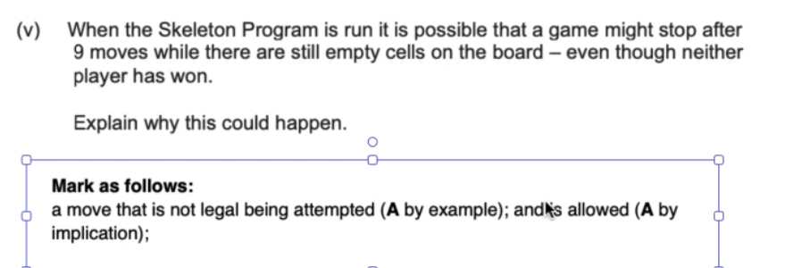
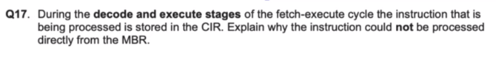
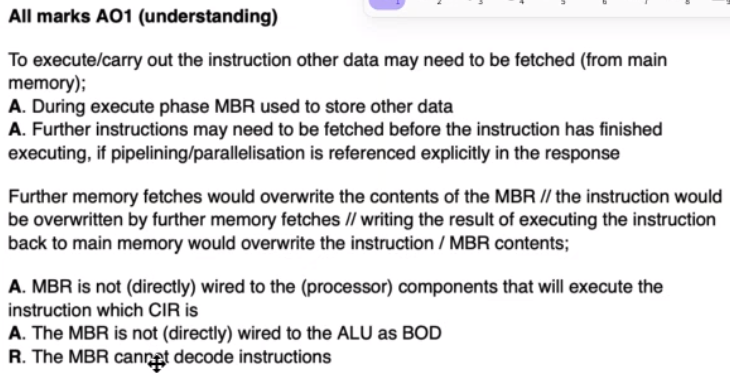
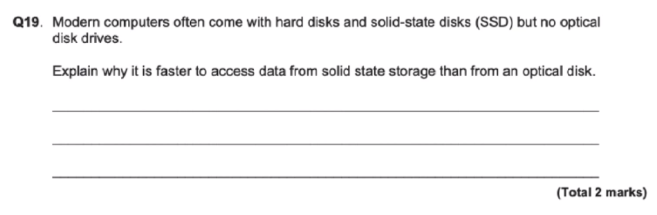

# 07/05/24

- boundary data:
    - data just inside/on/outside of the range values

    boundary data is on, just in, or just outside of the data that is allowed whereas erroneous data is data that is just wrong and will cause an error.

- ADC converter
    The Analogue signals are sampled at regular intervals. The amplitude samples are then encoded into intergers value and thoses integers are converted into binary

- when do we use pipelining
    - run multiple instructions at the same time
    - when we are using RISC
        - Reduced Instruction Set Computer

---

- purely electronic
- optical disks need to physically move the heads to the correct location on the disk

---

- rational number can be represented as fractions
- use words
- unisgned fixed point binary number
- measuring the amplitude of the wave (ADC)
- manomics
- the MBR may be busy
- immidieate addressing:
    - MOV R3, #42
- direct:
    - go to that memory location

