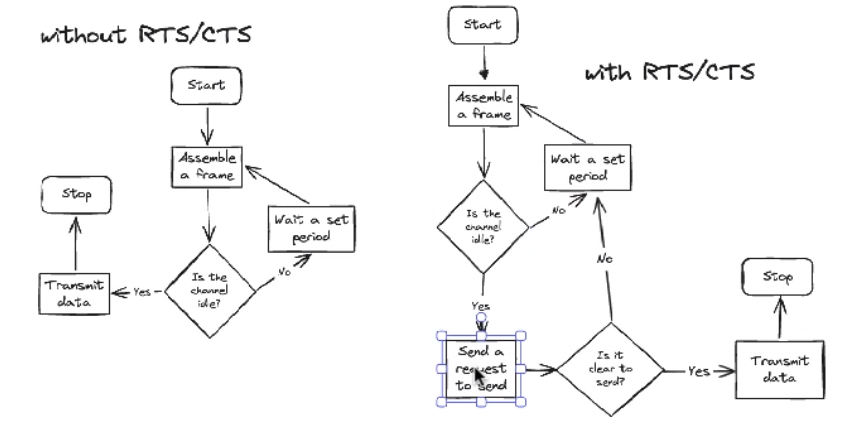
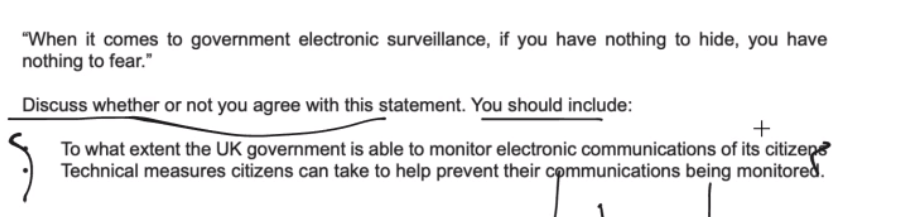

# 25/04/2024

- first = programming
- second = theory

## 3.8

- overlap happening

## CSMA/CA without RTS/CTS

- Carrier Sense Multiple Access with Collision Avoidance

- Hidden node problem
    - Node A and B
- CANT'T SEE EACH OTHER
    - you go first and I follow

- RTS/CTS
    - Request To Send/Clear To Send

---

# Error Checking

### Wifi

- sending analog signal
    - needs to converts to binary
        - use ADC
            - Analog Digital Converter
- inteferance
- amplitude too weak
    - can cause an error

## error checking method

- Majority Voting
    - repeat a bit an odd amount of time

    each bit is being repeated an odd amount of time, when data is sent, the data received is much more reliable as there needs to be multiple bits being flipped for teh data to be corrupted. However, the data to be tripled if using 3 bits repeat.

---

# Ethics

- level chosen before marks
- both ethical and legal
- coherent

- create a plan
    - underline keywords

- points
    - vpn
        - increase privacy
        - slower

- introduction
    - add some floavour/spice (lol)
        - exemple

in the UK has a wide reaching level of influence/monitoring of the communication of their citizen

---

# Ethics : Plan

- Negative
    - bitcoin farming
    - data centers
        - massive energy consuption 
        - massive heat generated
        - CO2 footprint

- Positive
    - massive caluclation capabilities
        - environmental problem solving
            - computers can help finding solutions about
                - decreasing/avoiding air/water polution
                - how to reduce environemental damages
                - alternative ressources which don't have a big environemental impact
