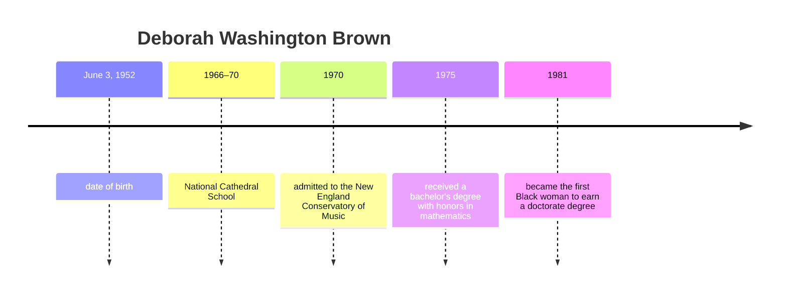

## Black Women research about their contribution in computer science

from 1940, beginning of computer science

- end of every class, 15 min:
    - produce some medias (can be an article, academic paper, video compilation)
    - compilation of media

# Deborah Washington Brown

June 3, 1952 - June 5, 2020

She was the first black woman to earn a doctorate in computer science (then a part of their applied math program) at Harvard University in 1981 and one of the first black female computer scientists to graduate from a U. S. doctoral program. Her first job was at Norden Systems, developing software for missile defense technology.

