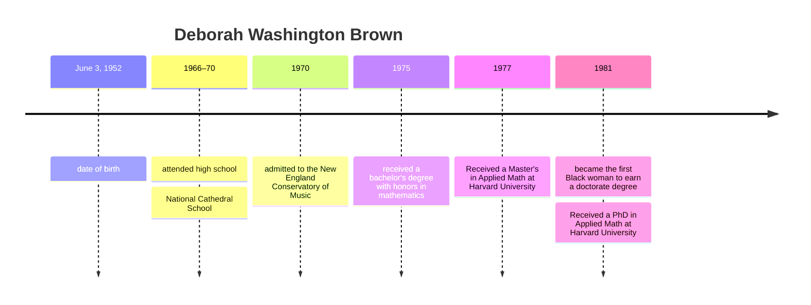

## Black Women research about their contribution in computer science

from 1940, beginning of computer science

- end of every class, 15 min:
    - produce some medias (can be an article, academic paper, video compilation)
    - compilation of media

# Deborah Washington Brown

June 3, 1952 - June 5, 2020

# Job and Carrer

- one of the first black female computer scientists to graduate from a U. S. doctoral program
- the first black woman to earn a doctorate in computer science
- received a Master's (1977) and a PhD (1981) in Applied Math at Harvard University

- first job was at Norden Systems, developing software for missile defense technology.
- four-decade career as a computer scientist at companies like Bells Labs and AT&T

# Personal life

- Married in 1979
- two daughters
- lived and worked in New Jersey and later Georgia.

# Sources

https://www.uml.edu/profiles/deborah-washington-brown.aspx

https://seas.harvard.edu/news/2020/06/alumni-profile-deborah-washington-brown-phd-81

https://en.wikipedia.org/wiki/Deborah_Washington_Brown