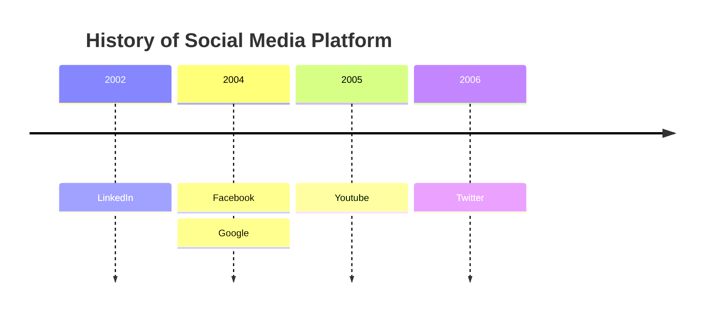

## Black Women research about their contribution in computer science

from 1940, beginning of computer science

- end of every class, 15 min:
    - produce some medias (can be an article, academic paper, video compilation)
    - compilation of media

# katherine johnson

American mathematician whose calculations of orbital mechanics as a NASA employee were critical to the success of the first and subsequent U.S. crewed spaceflights.

