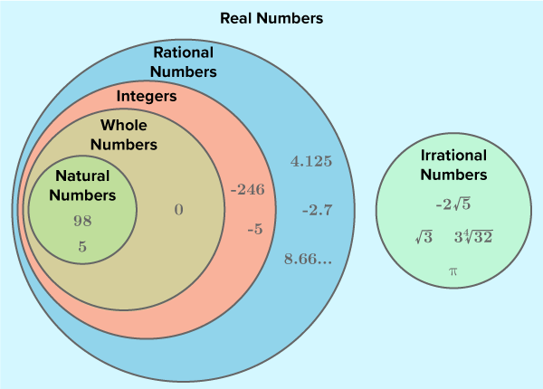

# 09/10/2023

# Objectives:

- Number sets
- Number Systems
- Real Number Systems

- Define:
    - natural 
    - interger
    - rational
    - irrational
    - real
- Describe ordinal numbers as the numerical position of items in ab ordered set
- Use natural numbers for counting and real numbers for measurement

# Real Number 

# Natural Numbers

The set of a natural numbers consists of ***only positive whole numbers and zero***, denoted by ℕ, as shown below:

    ℕ = {0,1,2,3,4,...}

- Be familiar with the concept of a natural number and the set ℕ of a natural numbers (including zero)

---

# Peano axioms

Zero Starting point

There needs to be nothing to have something

    0 = {}
    1 = 0U{} = {0}
    2 = 1U{0} = {0,1}
    3 = 2U{0,1} = {0,1,2}

---

# Rational Numbers

ℚ is a set of numbers that can be written as fractions (ratios of integers). Since a number such as 7 can be written as 7/1, ***all intergers are rational numbers.***

    ℚ={ab:a,b∈ℤ;b≠0}

Be familiar with the concept of a rational number and the set ℚ of rational numbers, and that this set includes the integers

--- 

# irrational Numbers

An irrational number is

# Real numbers

The set of real numbers consists of both rational and irrational numbers, denoted by ℝ; in other words, it is the set of all 'possible real world quantities'.

---
    
# Ordinal Numbers

When objects are placed in order, ordinal numbers are used to indicate their position. For exemple, if we have {'a','b','c','d'}, then 'a' is first, 'b' is second, and so on.

- Ordinal numbers arepositions within a sequence, such as first or last

---

# Counting and Measurement

Natural numbers should be associated with counting; real numbers should be assiciated with measurement;

- natural numbers, *int* in Python, used to count cycles of while-llops, indexes in for-loops

- real numbers, *float* in Python, used for measurements, the sresult of a vector dot product calculation; an approximation.

---

# Extension

For an extension task, research the complex and imaginary numbers; they are used in fields including, but not limited to, Electrical Engineering and Quantum Computing.

---

# Starter activity

Consider the following set-builder notation and discuss their meaning:

    N = {x | x ∈ Z,x >= 0}
    Z = {x | |x| ∈ N}

---

# 10/10/2023

# Learning objectives

- be familiar with:
    - concept of a number base (decimals)
    - binary
    - hexadecimal
        - Be able to use:
            - hexadecimal as a shorthand for binary (and why it's used in this way)

- convert between:
    - binary, hexadecimal number bases

---

# Number Bases

The base of a number is represented by subscript:

|number|binary|hexadecimal|
|-|-|-|
|123 (base 10)|01111011 (base 2)|7B(base 16)|

# Decimal Numbers (base 10)

decimal numbers use 10 numerical digits, from 0 to 9.

12310 = 100 + 20 = 3 = 1 * 102 + 2 * 101 + 3 * 100

|10^2|10|10|
|-|-|-|
|1|2|3|
|100|20|3|
|100 +|2 +| 3|

# Binary Numbers (Base 2)

Binary use only ***2 digits***, 0s and 1, where each digits * by the base (2):

01110112 = 6410+32+16+8+2+1 = 12310

|2^7 (128)|2^6 (64)|2^5 (32)|2^4 (16)|2^3 (8)|2^2 (4)|2^1 (2)|2^0 (1)|
|-|-|-|-|-|-|-|-|
|0|1|1|1|1|0|1|1|
|0 +|64 +|32 +|16 +|8 +|0 +|2 +|1|

# Hexadecimal (Base 16)

Hexadecimal numbers use 16 alphanumerical digits, including from 0 to 9, and A to F for denoting 10^15 to 15^10 (16^n)

7B16 = 710 * 161 + 1110 * 160 = 12310

|16^2 (256)| 16^1 (16)| 16^0 (1)|
|-|-|-|
|-|7|B|

|A|B|C|D|E|F|
|-|-|-|-|-|-|
|10|11|12|13|14|15|

# Base Conversion

3 number based used, but 6 conversion:

- Binary
    - Binary to Decimal
    - Binary to hexadecimal

- Hexadecimal
    - Hexidecimal to Binary
    - Hexidecimal to Decimal

- Decimal
    - Decimal to binary
    - Decimal to hexadecimal

# Hexadecimal to Decimal Conversion

|16^2 (256)| 16^1 (16)| 16^0 (1)|
|-|-|-|
|-|7(base 16)|B (base 16)|
|-|7 (base 10)| 11 (base 10)|

There is a 7 and a B

B = 11

161 = 1 * 16

160 = 1

123 mod 16 = 11

1110 = B16

# Binary to hexadecimal

Simply split the binary into ***nibbles*** (4 bits)

    01111011 (base 2) = 0111 (base 2), 1011 (base 2) = 7B (base 16)
    
    0111 (base 2) = 7 (base 10) = 7 (base 16)
    1011 (base 2) = 11 (base 10) = B (base 16)

---

# Hexidecimal Usage

It is ***shorthands*** for humans, uses less space than binary with an easier representation, uses less space on hard drive.
